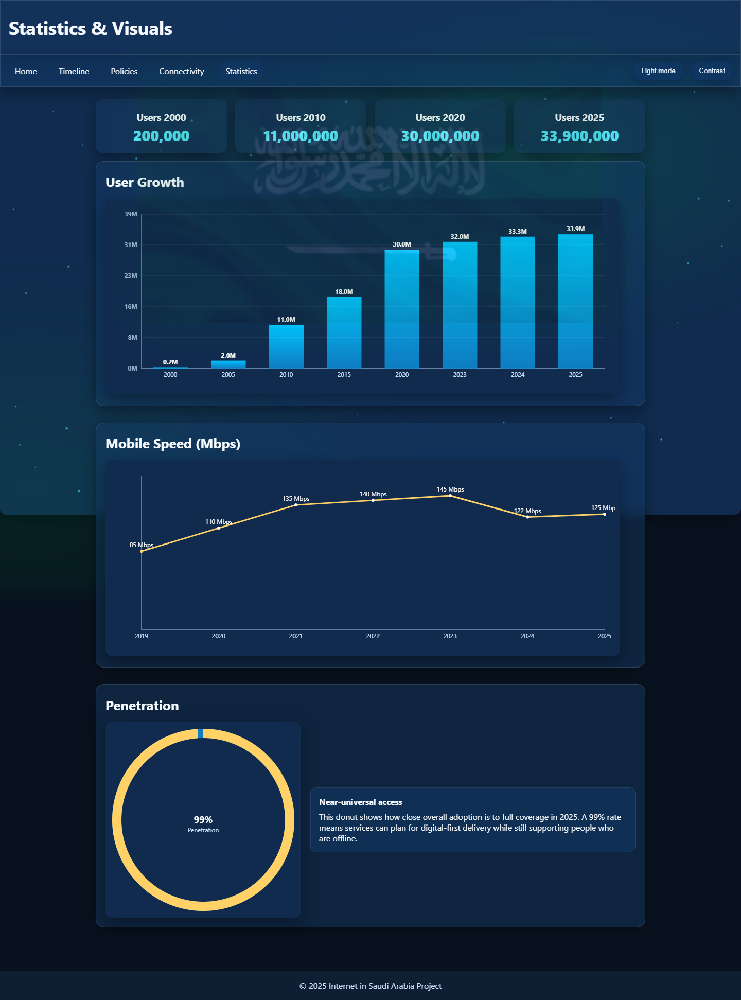

# Internet in Saudi Arabia

A multi-page educational website exploring the development of internet access in Saudi Arabia. Built with HTML, CSS and JavaScript, with a small Node.js/Express server for the connectivity dataset and a demonstration contribution API.

## Pages and features

- **Home:** introduction, summary figures and an audio player.
- **Timeline:** searchable milestones, a year filter and expandable details.
- **Policies:** expandable policy and governance entries.
- **Connectivity:** data loaded from the Express API, with search, category filters, sorting and grouping by decade.
- **Statistics:** canvas-based charts of user growth, mobile speed and internet penetration.
- Theme switching, a contrast toggle, skip links and back-to-top controls.

The included content and figures are coursework material, not a live or independently verified statistical service.

## Run locally

Install Node.js 18 or later and npm. In the repository root, run:

```sh
npm ci
npm start
```

Open [localhost:8080](http://localhost:8080). The same server serves the pages and the API; there is no separate frontend build step.

The **Connectivity** page is at [localhost:8080/pages/connectivity.html](http://localhost:8080/pages/connectivity.html).

The default port is **8080**. To use another port, set the `PORT` environment variable before starting the server. The pages and API use the same address.

## Project structure

```text
index.html                 Home page
pages/                     Timeline, policies, connectivity and statistics
assets/css/                Site styles
assets/js/                 Page behaviour, charts and validation helpers
assets/img/                Bundled images
assets/audio/              Bundled audio and its existing source note
data/                      Timeline, policy, statistics and media JSON files
server.js                  Express static server and demonstration API
package.json               Dependencies and start commands
```

## API

| Method | Path | Purpose |
| --- | --- | --- |
| GET | `/api/status` | Server status and dataset counts |
| GET | `/api/ping` | Basic availability response |
| GET | `/api/infrastructure` | Connectivity records |
| GET | `/api/contributions` | Contributions stored in the current server process |
| POST | `/api/contribute` | Accept a contribution containing numeric `year`, `title` and optional `details` |

Years must be integers from 1980 through next year, and titles cannot be empty. Contributions are stored in memory and disappear when the server restarts. This is a local demonstration API with no authentication or persistent database. The API is not a production submission service.

## Context and credits

Developed by Faizan Ilyas as a University of London **Web Development (CM1040)** coursework project.

The site uses [Express](https://expressjs.com/). Existing third-party media links, source URLs and credit metadata remain in `data/mediaRegistry.json`; the audio note remains in `assets/audio/README.txt`. Some media is loaded from external sites and requires internet access.

## Current limitations

- Historical content and statistics are static coursework data and should not be treated as current figures.
- External images or audio can become unavailable; the site includes some local assets and fallbacks.
- There is no offline service worker.

## Preview


